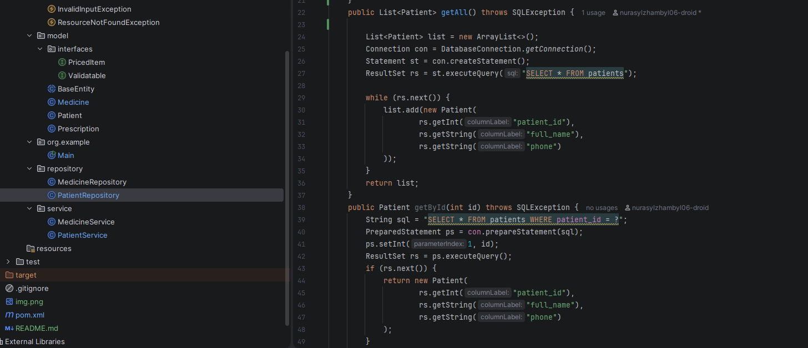
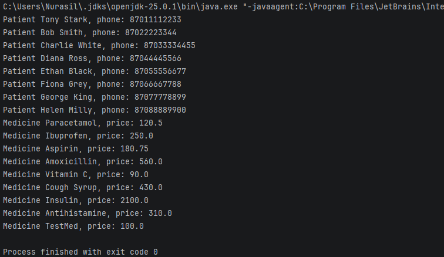

# Assignment 3 — Pharmacy & Prescriptions
## Java OOP + PostgreSQL (JDBC)

---

## Student Information
- **Name:** Nurasyl Zhambyl
- **Group:** SE-2518
- **Course:** Object-Oriented Programming (OOP)
- **Assignment:** 3

---

## Project Description
This project is a Java console application that demonstrates the use of
**Object-Oriented Programming principles** together with
**database connectivity using JDBC** and **PostgreSQL**.

The application works with a pharmacy domain model and connects to a real
PostgreSQL database to retrieve and display data using SQL queries.

The main goal of this assignment is to show:
- correct OOP structure
- exception handling
- JDBC usage
- interaction between Java and PostgreSQL

---

## Technologies Used
- **Java (JDK 17 +)**
- **PostgreSQL 16**
- **JDBC (Java Database Connectivity)**
- **Maven**
- **IntelliJ IDEA**
- **pgAdmin 4**

---

## Database Overview

The PostgreSQL database is named **Pharmacy** and includes the following tables:

- `patients` — stores patient information
- `doctors` — stores doctors data
- `medicines` — list of medicines with prices
- `prescriptions` — prescriptions issued by doctors
- `prescription_items` — medicines inside prescriptions
- `sales` — sales information related to prescriptions

The database structure and data were verified using **pgAdmin**.




---

## OOP Concepts Used

- **Encapsulation**  
  Data fields are private and accessed through getters/setters.

- **Inheritance**  
  Common fields are placed in `BaseEntity`.

- **Interfaces**  
  `Validatable` and `PricedItem` define shared behavior.

- **Dependency Injection**  
  `Connection` is passed to repositories via constructor.

- **Exception Handling**  
  Custom exceptions and `try-catch` blocks are used to handle runtime problems.

---

## JDBC and Database Connection

The database connection is handled in the `DatabaseConnection` class using JDBC:

```java
DriverManager.getConnection(url, user, password)

The PostgreSQL JDBC driver is added via Maven dependency.

All database operations use:

PreparedStatement

ResultSet


This approach prevents SQL injection and ensures safe database access.


---

Repository Layer

Repositories are responsible for executing SQL queries and mapping database records to Java objects:

PatientRepository

MedicineRepository


Each repository receives a Connection object and performs database operations such as retrieving all records.


---

Program Execution Flow

1. Application starts from Main.java


2. Database connection is established


3. Repository executes SQL query


4. Results are processed and displayed in the console


5. Connection is closed safely

